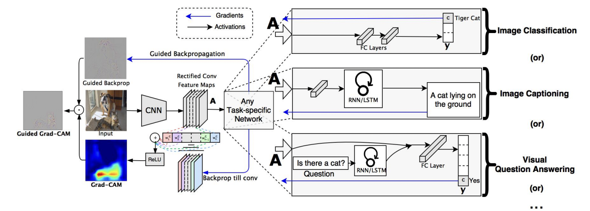
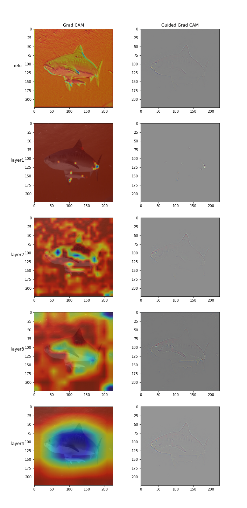

# Explainable CNNs
[](#torch) [](#torchvision) [](#python) [](.github/workflows/test_workflow.yml) [](#price) [](#maintained)

**📦 Flexible visualization package for generating layer-wise explanations for CNNs.**

It is a common notion that a Deep Learning model is considered as a black box. Working towards this problem, this project provides flexible and easy to use `pip` package `explainable-cnn` that will help you to create visualization for any `torch` based CNN model. Note that it uses one of the data centric approach. This project focusses on making the internal working of the Neural layers more transparent. In order to do so, `explainable-cnn` is a plug & play component that visualizes the layers based on on their gradients and builds different representations including Saliency Map, Guided BackPropagation, Grad CAM and Guided Grad CAM. 

## Architechture

<p align="center">
</img>
</p>
:star: Star us on GitHub — it helps!

## Usage

Install the package 

```bash
pip install explainable-cnn
```

To create visualizations, create an instance of `CNNExplainer`.

```python
from explainable_cnn import CNNExplainer

x_cnn = CNNExplainer(...)
```

The following method calls returns `numpy` arrays corresponding to image for different types of visualizations.

```python
saliency_map = x_cnn.get_saliency_map(...)

grad_cam = x_cnn.get_grad_cam(...)

guided_grad_cam = x_cnn.get_guided_grad_cam(...)
```

<p>To see full list of arguments and their usage for all methods, please refer to <a href="src/explainable_cnn/explainers/cnn_explainer.py">this file</a>.</p>
<p>You may want to look at example usage in the <a href="examples/explainable_cnn_usage.ipynb">example notebook</a>.</p>

## Output
<p>Below is a comparison of the visualization generated between GradCam and GuidedGradCam </p>

<p align="center"> 
    </img>
</p>

## References

- [Grad-CAM: Visual Explanations from Deep Networks via Gradient-based Localization](https://arxiv.org/pdf/1610.02391.pdf)
- Grad CAM demonstrations in PyTorch (see `kazuto1011/grad-cam-pytorch` on GitHub)
